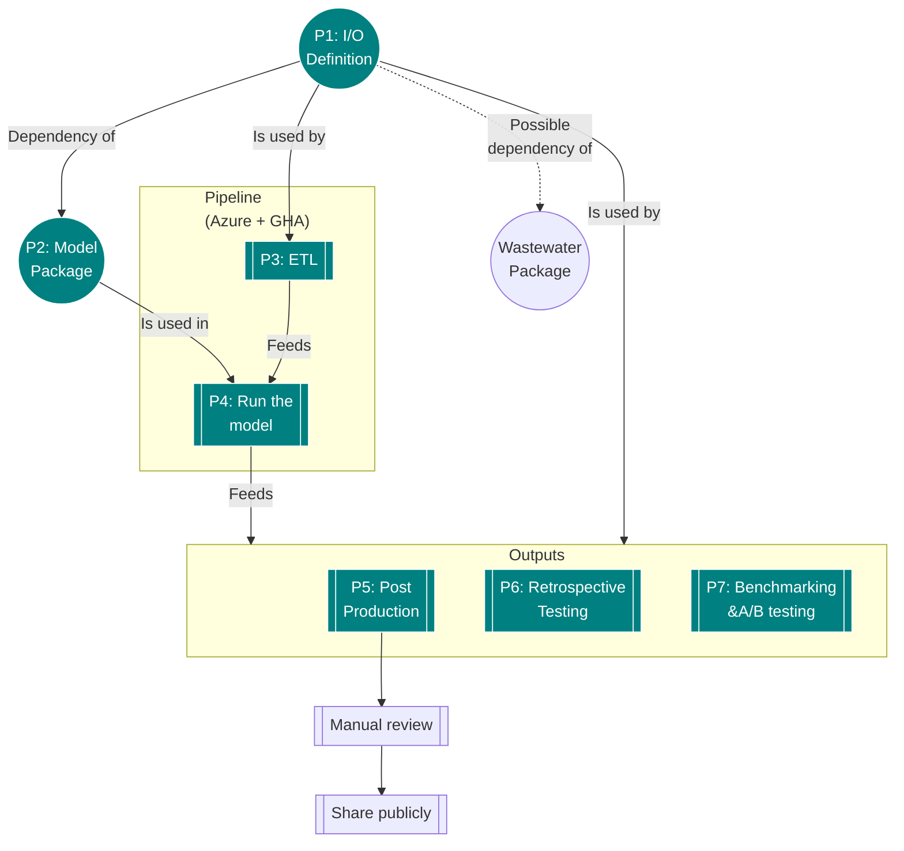

# Forecasting-Tornadoes

This repository covers up to several models for forecasting tornadoes. The authors of these models are not experts in climate modelling or tornado dynamics.

Forecasting repositories, such as this one (usually created by @AFg6K7h4fhy2), are typically positioned as small experimental test units for tackling Metaculus questions with statistical modelling.

If you are a collaborator, make sure, upon cloning this repository

* `git clone https://github.com/AFg6K7h4fhy2/Forecasting-Tornadoes.git`

that you have `poetry` installed.

* `pip3 install poetry`

Once this is done, type `poetry shell`. To close the environment, type `exit`.

## Repository Structure

`tree | grep -Ev "\.png|\.pyc|\.txt|\.csv"`


```
.
├── CONTRIBUTING.md
├── LICENSE
├── README.md
├── _typos.toml
├── assets
│   └── figures
├── data
│   ├── clean
│   └── raw
├── model_E414_01
│   ├── __init__.py
│   ├── docs
│   │   ├── Makefile
│   │   ├── output
│   │   │   └── out.pdf
│   │   └── source
│   │       ├── metadata.yml
│   │       ├── model.md
│   │       └── references.bib
│   ├── output
│   │   ├── April_2024
│   │   └── May_2024
│   ├── params.toml
│   └── src
│       ├── __init__.py
│       ├── __pycache__
│       ├── model.py
│       └── run.py
├── poetry.lock
├── pyproject.toml
└── utils
    ├── __init__.py
    ├── __pycache__
    ├── config.py
    ├── data.py
    ├── inf.py
    ├── save.py
    ├── transform.py
    └── vis.py

17 directories, 92 files
```


## Setting Up A Model


## Model Notes: E414 01

__Equations__


__Diagram__



